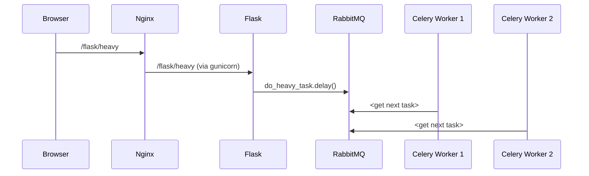

# FlaskCeleryDocker

This repo contains a reference implementation of Flask running tasks using Celery.
The Flask server is invoked by `gunicorn` and sits behind an `nginx` proxy. 
The Celery workers are backed by RabbitMQ. The `flask`, `celery`, `nginx` and `rabbitmq`
processes each runs in its own Docker container.

## Why not docker-compose?

Docker compose would have been easier to use. For this example I didn't want to use it for the 
following reasons:

1. I wanted to learn how to create custom Docker networks so that containers could be named and communicate with each other.
2. I wanted a solution that would allow me to add containers on the fly - for purposes of illustration.
3. I wanted to get a deeper understanding of Docker.

## What's in this repo

There are two demos (sets of sample code) in this project: 

+ `flask/standalone_app.py` that has everything you need in one file
+ The larger docker-based example

## What's _not_ in this repo

This repo does not attempt to explain _why_ one would want to use Celery with Flask. Or what the pros 
and cons are when using RabbitMQ vs Redis. Or what purpose backends serve. This repo is to be used
as part of a one-hour demo/explanation of concepts. There are several good articles and videos about
this online. One of the best ones out there is https://youtu.be/iwxzilyxTbQ.

## The standalone version

+ `cd` into `flask`
+ Run `pip3 install -r requirements.txt`
+ Run `python3 ./standalone_app.py`. This will launch a web server listening on port 8080
+ In another terminal start the celery worker
  - In the parent directory of `flask`, run `./start_local_celery.sh`
+ Now direct your browser to http://localhost:8080/flask/heavy.
  + This will kick off a celery task. You should be able to see the logs in the `start_local_celery.sh` output.

## The docker version

### Containers

There are four Docker containers in this system:

1. The `nginx` container hosts the main [Nginx](https://nginx.org/en/docs/) web page and proxy.
   1. Any request with the `/flask` URL prefix is proxied to the `flask` container
2. The `flask` container hosts the [Flask](https://flask.palletsprojects.com/en/2.1.x/) app. This is done via the [gunicorn HTTP server](https://gunicorn.org/).
3. The `rabbitmq` container runs [RabbitMQ](https://www.rabbitmq.com/) which is used as Celery's broker.
4. The `celery` container runs a [Celery](https://docs.celeryq.dev/) worker. One key point of this demo is that once can launch additional celery containers to speed up processing of the queue.

### The container network

These containers need to communicate with each other. The Nginx container needs to proxy to the 
Flask container. The Flask and the Celery containers need to use the broker running in the
RabbitMQ container. 

By default, there is no way to tell what IP address will be assigned to each container. So the 
code and config files cannot specify an IP address to refer to the flask and rabbitmq containers.

The approach this demo uses is to create a Docker bridge network named `my_network`. When the 
containers are created, they are assigned to this network, and assigned a name. Docker will then 
assign the container that name as its hostname on that bridge network. This allows us to use the 
hostname in the code and config files.

### Docker bind mounts

For illustration purposes there are two bind mounts used in this demo. The first is `/document_root`
which is the document root of the nginx server. This is used to show how nginx is used to serve
static files off the document root and also proxy more complicated requests to the Flask web
server.

The second bind mount is `/db`. This is used to host the `backend.db` sqlite3 database file. Both, 
the Flask and Celery containers need to be able to access the Celery backend. I chose to use 
sqlite3 instead of Postgres as a backend database because the former is easier to set up for the
purposes of this demo.

### Container sequence diagram

